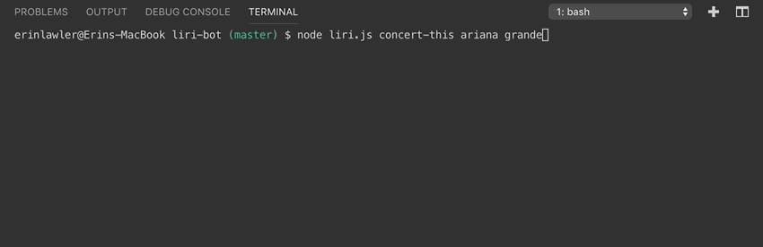
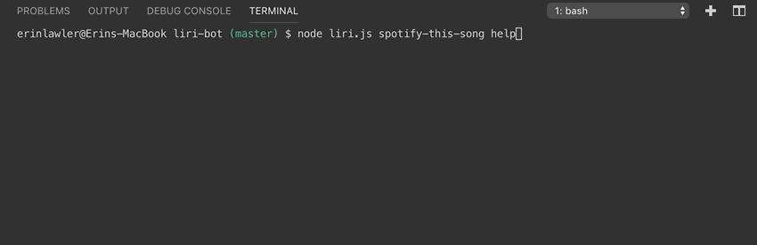
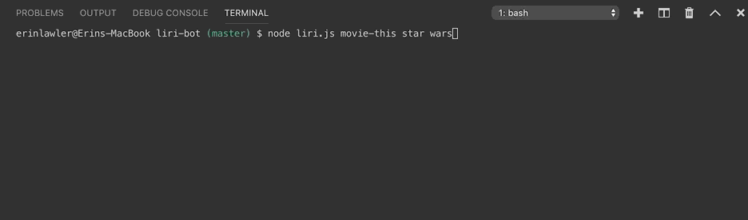
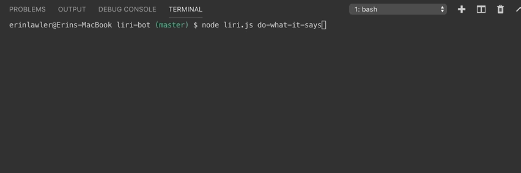

# liri-bot
LIRI is like iPhone's SIRI. However, while SIRI is a Speech Interpretation and Recognition Interface, LIRI is a Language Interpretation and Recognition Interface. LIRI will be a command line node app that takes in parameters and gives you back data.

Type 'node liri.js' into the command line, along with one of four commands: 'concert-this', 'spotify-this', 'movie-this', or 'do-what-it-says'. Follow this with a parameter: 'concert-this' should be followed by an artist name, 'spotify-this' should be followed by a song title, 'movie-this' should be followed by a movie title, and 'do-what-it-says' requires no parameters.

**Concert-This** :microphone:

This will search the Bands in Town Artist Events API for an artist and render the following information about each event to the terminal:

   * Name of the venue
   * Venue location
   * Date of the Event

**Spotify-This** :musical_keyboard:

Utilizes both the node-spotify-api package and the Spotify API in order to retrieve the following song information:

   * The song's name
   * A preview link of the song from Spotify
   * The album that the song is from

**Movie-This** :clapper:

The axios package is used to retrieve data from the OMDB API to retreive the following movie information:

   * Title of the movie.
   * Year the movie came out.
   * IMDB Rating of the movie.
   * Rotten Tomatoes Rating of the movie.
   * Country where the movie was produced.
   * Language of the movie.
   * Plot of the movie.
   * Actors in the movie.

**Do-What-It-Says** :ok:

The fs Node package is used to take the text inside of random.txt and then use it to call one of LIRI's commands.

